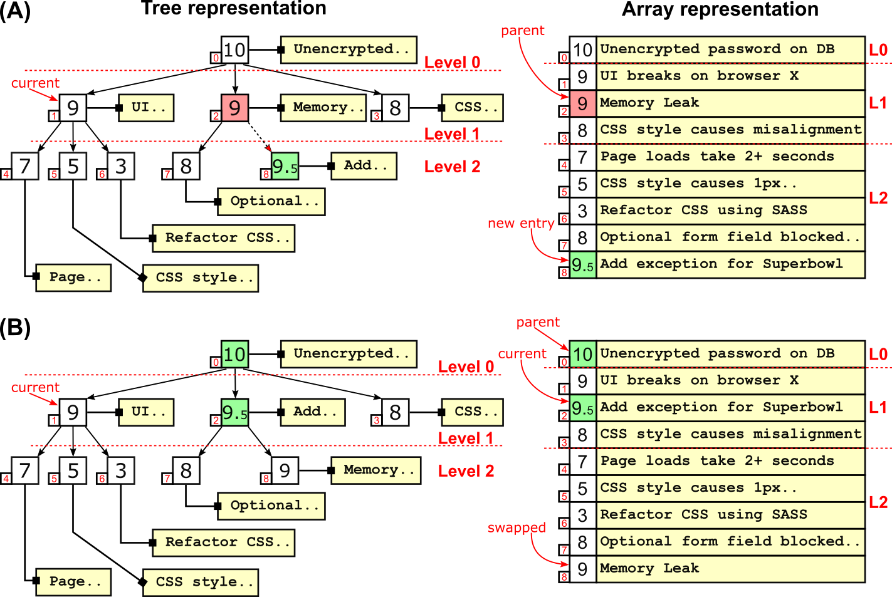
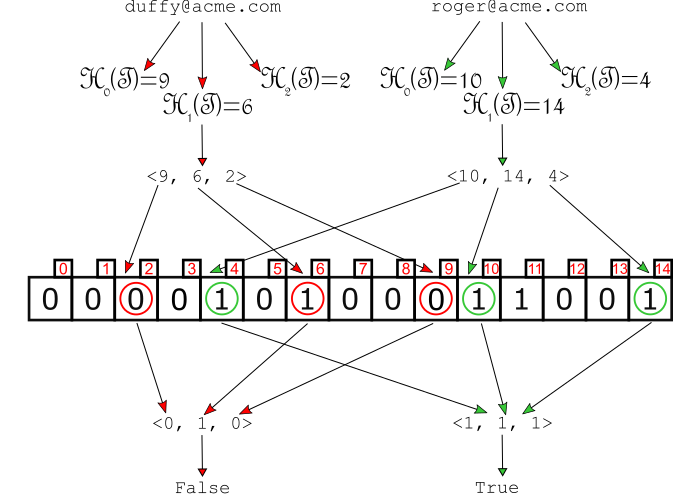
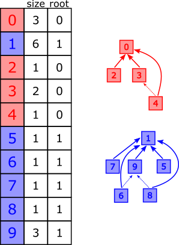
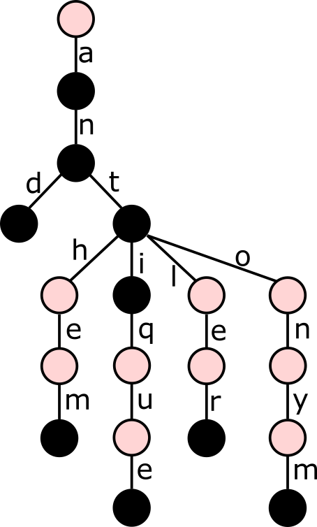
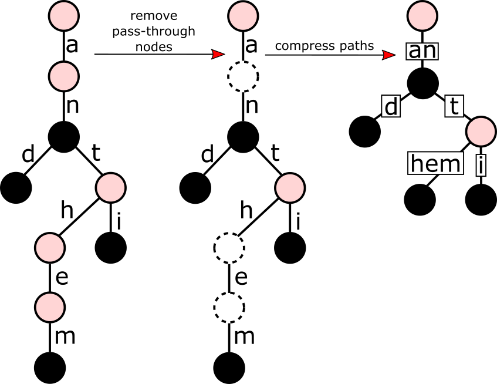
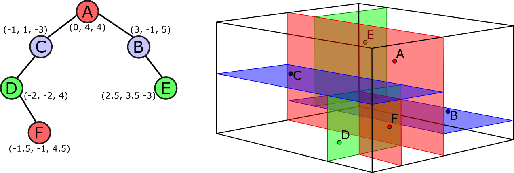
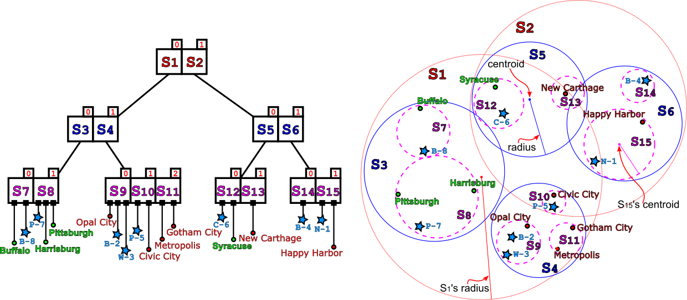

A collection of data structures implementing what's presented in the book ["Algorithms and Data Structures in Action"](https://www.manning.com/books/algorithms-and-data-structures-in-action#toc).

# Installation

From the base folder:

```bash
nvm install stable

npm install
```


# Run tests

From the base folder:

```bash
npm t test/$FOLDER/$TEST
```

For instance

```bash
npm t test/geometric/test_point.js
```

# Data Structures

## [D-ary heap](https://livebook.manning.com/book/algorithms-and-data-structures-in-action/chapter-2)
A heap  is  conceptually a  tree,  but it’s implemented  using  an array for the sake of efficiency.
While regular heaps are binary balanced trees, d-ary heaps use d-ary trees, reducing the tree's height.
Depending on what operations are performed more frequently on the heap, a larger branching factor can provide a significant speed-up.

[](https://livebook.manning.com/book/algorithms-and-data-structures-in-action/chapter-2)

## [Bloom Filter](https://livebook.manning.com/book/algorithms-and-data-structures-in-action/chapter-4)

Bloom  filters  work like sets, storing entries and allowing fast lookup. In exchange of a (tunable) ratio of false positives, they allow  to store  large  sets  using  only a constant number of bits per key (while hash-tables, for instance, would require space proportional to the size of the keys).

[](https://livebook.manning.com/book/algorithms-and-data-structures-in-action/chapter-4)

## [Disjoint Set](https://livebook.manning.com/book/algorithms-and-data-structures-in-action/chapter-5)

We use a disjoint-set every time that, starting with a set of objects, we would like to account for the partitioning of this set into disjoint groups (i.e. sub-sets without any element in common between them).

[](https://livebook.manning.com/book/algorithms-and-data-structures-in-action/chapter-5)

## [Trie](https://livebook.manning.com/book/algorithms-and-data-structures-in-action/chapter-6)

This data structure allows to more efficiently store and query large sets of strings, assuming many of them share some common prefixes. Many applications manipulating  strings can  benefit from  using trie, from  spell-checkers to bioinformatics.

[](https://livebook.manning.com/book/algorithms-and-data-structures-in-action/chapter-6)

## [Radix Trie (aka Patricia Tree)](https://livebook.manning.com/book/algorithms-and-data-structures-in-action/chapter-6)

Storing  tries  can be cheaper  than holding  these  values  in  binary  search trees  or  hash  tables, but  it  can require  a  lot of  memory. Radix  tries  compress  paths, whenever  possible, to provide  a  more  compact  representation  of  these  tries,  without having to compromise interms of complexity or performance.

[](https://livebook.manning.com/book/algorithms-and-data-structures-in-action/chapter-6)

## [K-d Tree](https://livebook.manning.com/book/algorithms-and-data-structures-in-action/chapter-9)
K-d  trees  are  an  advanced  data  structure  that  helps  performing  spatial queries  (nearest  neighbor  search  and  intersections  with  spherical  or  rectangular regions) more efficiently.
K-d  trees  are  great  with  low-and  medium-dimensional  spaces,  but  suffer sparsity of high-dimensional spaces; they also work  better  on  static  datasets,  because  we  can  build  balanced trees on construction, but insert and remove are not self-balancing operations.

[](https://livebook.manning.com/book/algorithms-and-data-structures-in-action/chapter-9)

## [Ss-Tree](https://livebook.manning.com/book/algorithms-and-data-structures-in-action/chapter-10)
To overcome the issues with k-d trees, alternative data structures like R-trees and Ss-trees have been introduced.

Ss+-trees cluster data in overalpping hyperspheres, using a few heuristics to maintain the tree as balanced as possible.

Although  none of these structures can offer any  guarantee  on  the worst-case  running time,  in  practice they  perform  better  than  k-d  trees in  many  situations,  and  especially for higher-dimensional data.

[](https://livebook.manning.com/book/algorithms-and-data-structures-in-action/chapter-10)

## Needleman-Wunsch algorithm for string alignment

The Needleman–Wunsch algorithm is an algorithm used in bioinformatics to align protein or nucleotide sequences.