# **Algorithms and Data Structures in Action**

This repository contains a collections of data structures and algorithms from the Manning book _Algorithms and Data Structures in Action_-

You can buy the book on Manning's web site:
https://www.manning.com/books/algorithms-and-data-structures-in-action

The book explains these data structures using pseudo-code, because we wanted to highlight the logic of the algorithms rather than having to focus on the implementation details intrinsic to any programming language.

At the same time, hands-on learning is also an important part of the teaching process, so we gathered here a collection of implementations of those same algorithms, using a few different programming languages.

For each data structure, you can find the link(s) to the livebook Manning's website, where you can take a quick look at the material and preview the book.

[Here](https://livebook.manning.com/book/algorithms-and-data-structures-in-action/chapter-1) you can read more about the structure and content of the book: feel free to take a look and decide if it's the right algorithms book for you.

To have a taste of how the book is structured, you can also read this free excerpt from chapter 1, discussing the process of designing an algorithm by progressively solving the "knapsack problem".

[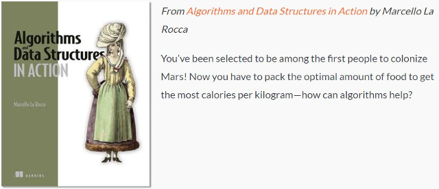](https://freecontent.manning.com/packing-your-knapsack-for-a-trip-to-mars/)

# **D-ary heap**
## | [Chapter 2](https://livebook.manning.com/book/algorithms-and-data-structures-in-action/chapter-2) | [Java](https://github.com/mlarocca/AlgorithmsAndDataStructuresInAction/tree/master/Java/src/org/mlarocca/containers/priorityqueue/heap) | [JavaScript](https://github.com/mlarocca/AlgorithmsAndDataStructuresInAction/tree/master/JavaScript/src/dway_heap) | [Python](https://github.com/mlarocca/AlgorithmsAndDataStructuresInAction/tree/master/Python/mlarocca/datastructures/heap) | [Jupyter Notebook (profiling)](https://github.com/mlarocca/AlgorithmsAndDataStructuresInAction/blob/master/Python/mlarocca/notebooks/Huffman_profiling.ipynb) |

[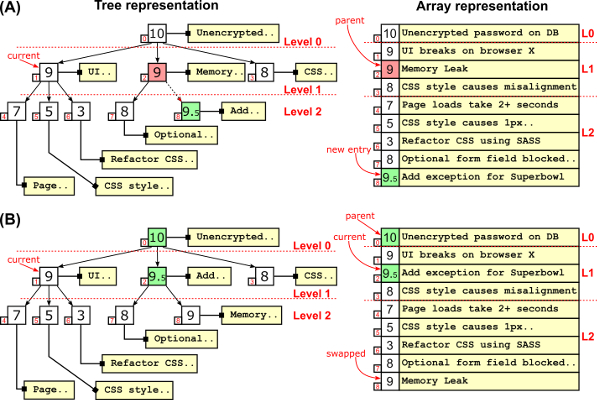](./JavaScript/readme/d-way_heap.png)

A heap  is  conceptually a  tree,  but it’s implemented  using  an array for the sake of efficiency.
While regular heaps are binary balanced trees, d-ary heaps use d-ary trees, reducing the tree's height.
Depending on what operations are performed more frequently on the heap, a larger branching factor can provide a significant speed-up.

# **Huffman Compression**
## | [Chapter 2](https://livebook.manning.com/book/algorithms-and-data-structures-in-action/chapter-2/v-8/373) | [Java](https://github.com/mlarocca/AlgorithmsAndDataStructuresInAction/tree/master/Java/src/org/mlarocca/huffman) | [Python](https://github.com/mlarocca/AlgorithmsAndDataStructuresInAction/tree/master/Python/mlarocca/datastructures/huffman) |

[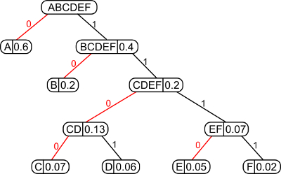](./readme/huffman.jpg)

Huffman's algorithm is probably the most famous data compression algorithm: a simple, brilliant greedy algorithm that, despite not being the state of the art for compression anymore, was a major breakthrough in the '50s.

A Huffman code is a tree, built bottom up, starting with the list of different characters appearing in a text and their frequency. The algorithm iteratively:

1.	selects and removes the two elements in the list with the smallest frequency
2.	then creates a new node by combining them (summing the two frequencies)
3.	and finally adds back the new node to the list.

## **Free article on Huffman Coding Algorithm**

[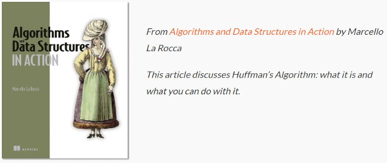](https://freecontent.manning.com/data-compression-with-huffmans-algorithm/)

# **Treap**
## | [Chapter 3](https://livebook.manning.com/book/algorithms-and-data-structures-in-action/chapter-3) | [Java](https://github.com/mlarocca/AlgorithmsAndDataStructuresInAction/tree/master/Java/src/org/mlarocca/containers/treap) | [Jupyter Notebook (profiling)](https://github.com/mlarocca/AlgorithmsAndDataStructuresInAction/blob/master/Python/mlarocca/notebooks/treaps_profiling.ipynb) |

[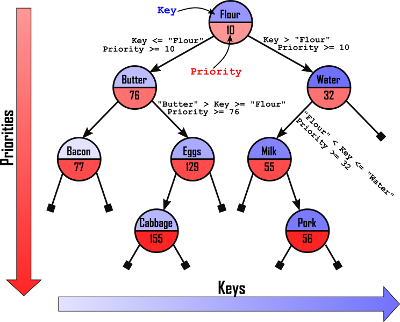](./readme/treap.jpg)

Treap is  the _portmanteau_ of tree and heap: binary search trees, in fact, offer the best average performance across all standard operations:  `insert`, `remove`  and `search`  (and also `min` and `max`). Heaps, on the other hand, allow to  efficiently keep track of priorities using a tree-like structure. Treaps merge the characteristics of these two data strucures to get the best of both.

# **Bloom Filter**
## | [Chapter 4](https://livebook.manning.com/book/algorithms-and-data-structures-in-action/chapter-4) | [JavaScript](https://github.com/mlarocca/AlgorithmsAndDataStructuresInAction/tree/master/JavaScript/src/bloom_filter) |

[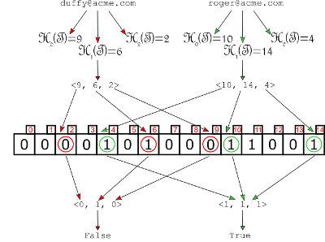](./JavaScript/readme/bloom_filter.png)

Bloom  filters  work like sets, storing entries and allowing fast lookup. In exchange of a (tunable) ratio of false positives, they allow  to store  large  sets  using  only a constant number of bits per key (while hash-tables, for instance, would require space proportional to the size of the keys).

# **Disjoint Set**
## | [Chapter 5](https://livebook.manning.com/book/algorithms-and-data-structures-in-action/chapter-5) | [JavaScript](https://github.com/mlarocca/AlgorithmsAndDataStructuresInAction/tree/master/JavaScript/src/disjointset) |

[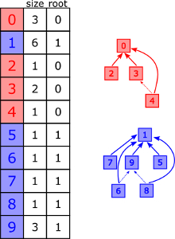](./readme/union_find.jpg)

We use a disjoint-set every time that, starting with a set of objects, we would like to account for the partitioning of this set into disjoint groups (i.e. sub-sets without any element in common between them).

# **Trie**
## | [Chapter 6](https://livebook.manning.com/book/algorithms-and-data-structures-in-action/chapter-6) | Java (in progress) | [JavaScript](https://github.com/mlarocca/AlgorithmsAndDataStructuresInAction/blob/master/JavaScript/src/trie/trie.js) |

[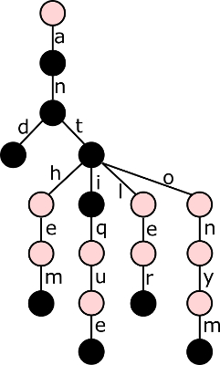](./JavaScript/readme/trie.png)

This data structure allows to more efficiently store and query large sets of strings, assuming many of them share some common prefixes. Many applications manipulating  strings can  benefit from  using trie, from  spell-checkers to bioinformatics.

# **Radix Trie (aka Patricia Tree)**
## | [Chapter 6](https://livebook.manning.com/book/algorithms-and-data-structures-in-action/chapter-6) | Java (in progress) | [JavaScript](https://github.com/mlarocca/AlgorithmsAndDataStructuresInAction/blob/master/JavaScript/src/trie/radix_tree.js) |

[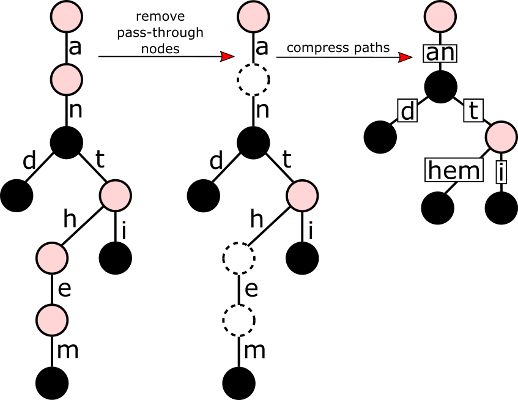](./JavaScript/readme/radix_tree_compression.png)

Storing  tries  can be cheaper  than holding  these  values  in  binary  search trees  or  hash  tables, but  it  can require  a  lot of  memory. Radix  tries  compress  paths, whenever  possible, to provide  a  more  compact  representation  of  these  tries,  without having to compromise interms of complexity or performance.

# _Extra_: **Needleman-Wunsch** String Alignment Algorithm
## | [JavaScript](https://github.com/mlarocca/AlgorithmsAndDataStructuresInAction/tree/master/JavaScript/src/strings) |

The Needleman–Wunsch algorithm is an algorithm used in bioinformatics to align protein or nucleotide sequences.

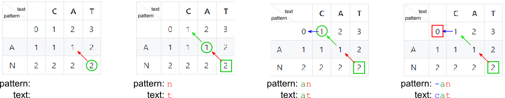

# **Cache**
## | [Chapter 7](https://livebook.manning.com/book/algorithms-and-data-structures-in-action/chapter-7) | [Java](https://github.com/mlarocca/AlgorithmsAndDataStructuresInAction/tree/master/Java/src/org/mlarocca/containers/cache) |

[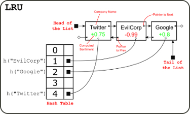](./readme/LRU.jpg)
[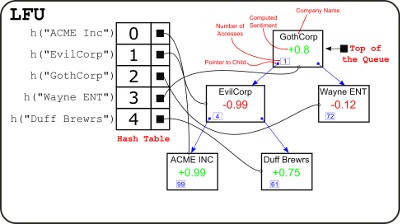](./readme/LFU.jpg)

Thread safe implementations of LRU and LFU caches: a data structure that is vital at many levels of internet-based applications, allowing to remember recently (or frequently) seen data and the saving remote call, or expensive computation, that would be needed to retrieve those data again.

# **K-d Tree**
## | [Chapter 9](https://livebook.manning.com/book/algorithms-and-data-structures-in-action/chapter-9) | [JavaScript](https://github.com/mlarocca/AlgorithmsAndDataStructuresInAction/tree/master/JavaScript/src/kd_tree) |

[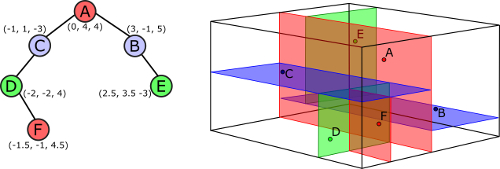](./JavaScript/readme/k-d_tree.png)

K-d  trees  are  an  advanced  data  structure  that  helps  performing  spatial queries  (nearest  neighbor  search  and  intersections  with  spherical  or  rectangular regions) more efficiently.
K-d  trees  are  great  with  low-and  medium-dimensional  spaces,  but  suffer sparsity of high-dimensional spaces; they also work  better  on  static  datasets,  because  we  can  build  balanced trees on construction, but insert and remove are not self-balancing operations.

# **Ss-Tree**
## | [Chapter 10](https://livebook.manning.com/book/algorithms-and-data-structures-in-action/chapter-10) | [JavaScript](https://github.com/mlarocca/AlgorithmsAndDataStructuresInAction/tree/master/JavaScript/src/ss_tree) |

[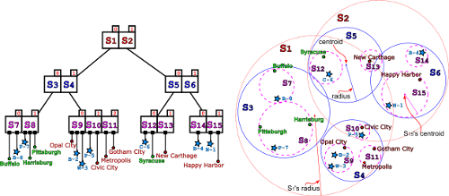](./JavaScript/readme/ss_tree.png)

To overcome the issues with k-d trees, alternative data structures like R-trees and Ss-trees have been introduced.

Ss+-trees cluster data in overalpping hyperspheres, using a few heuristics to maintain the tree as balanced as possible.

Although  none of these structures can offer any  guarantee  on  the worst-case  running time,  in  practice they  perform  better  than  k-d  trees in  many  situations,  and  especially for higher-dimensional data.

# **K-means**
## | [Chapter 12](https://livebook.manning.com/book/algorithms-and-data-structures-in-action/chapter-12) | [Chapter 13 (MapReduce)](https://livebook.manning.com/book/algorithms-and-data-structures-in-action/chapter-13) | [Python](https://github.com/mlarocca/AlgorithmsAndDataStructuresInAction/blob/master/Python/mlarocca/datastructures/clustering/kmeans.py) | [Jupyter notebook (demo)](https://github.com/mlarocca/AlgorithmsAndDataStructuresInAction/blob/master/Python/mlarocca/notebooks/k_means.ipynb) | [Jupyter Notebook (profiling)](https://github.com/mlarocca/AlgorithmsAndDataStructuresInAction/blob/master/Python/mlarocca/notebooks/kmeans_profiling.ipynb) |

[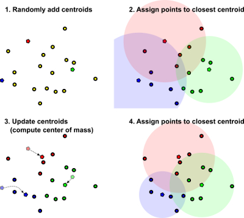](./readme/k-means.jpg)

`k-means` is the simplest and oldest clustering algorithm; it partitions data in a pre-determined number of spherical clusters.

## **Free article on MapReduce**

[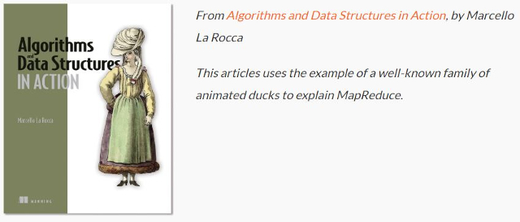](https://freecontent.manning.com/explaining-mapreduce-with-ducks/)

# **DBSCAN**
## | [Chapter 12](https://livebook.manning.com/book/algorithms-and-data-structures-in-action/chapter-12) | [Chapter 13 (MapReduce)](https://livebook.manning.com/book/algorithms-and-data-structures-in-action/chapter-13) | [Python](https://github.com/mlarocca/AlgorithmsAndDataStructuresInAction/blob/master/Python/mlarocca/datastructures/clustering/dbscan.py) | [Jupyter notebook (demo)](https://github.com/mlarocca/AlgorithmsAndDataStructuresInAction/blob/master/Python/mlarocca/notebooks/dbscan.ipynb) |

[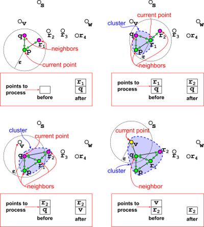](./readme/db_scan_steps.jpg)

`DBSCAN` is an acronym for “Density-based spatial clustering of applications with noise”, and the main difference in the approach with respect to `k-means` is already clear from its name: while k-means is a centroid-based algorithm, and as such builds clusters as convex sets around points elected as centroids, a density-based algorithm defines clusters as sets of points that are close to each other, close enough that the density of points in any area of a cluster is above a certain threshold.

# **OPTICS**
## | [Chapter 12](https://livebook.manning.com/book/algorithms-and-data-structures-in-action/chapter-12) | [Python](https://github.com/mlarocca/AlgorithmsAndDataStructuresInAction/blob/master/Python/mlarocca/datastructures/clustering/optics.py) | [Jupyter notebook](https://github.com/mlarocca/AlgorithmsAndDataStructuresInAction/blob/master/Python/mlarocca/notebooks/optics.ipynb) |

[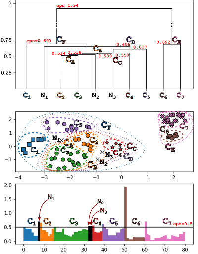](./readme/optics_dendrogram.jpg)

The idea behind `OPTICS` is that the order in which points are processed does matter, and in particular it can make sense to keep expanding a “frontier” for current cluster by adding the unprocessed point that is closest to the cluster (if it is reachable from the cluster).

# **Canopy Clustering**
## | [Chapter 13](https://livebook.manning.com/book/algorithms-and-data-structures-in-action/chapter-13) |

[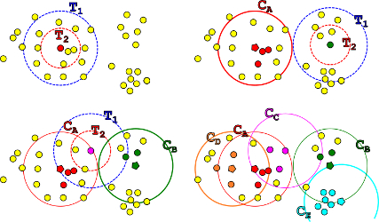](./readme/canopy_clustering.jpg)

`Canopy clustering` groups points into spherical regions (circles in our 2D examples), like `k-means`, but unlike it, these regions can overlap, and most points are assigned to more than one region.
The canopy clustering algorithm is faster and simpler than k-means, as it runs in a single pass, doesn’t have to compute the centroids for the canopies (spherical pseudo-clusters), and doesn’t compare each point to each centroid; instead, it elects one point in the dataset as the center of each canopy, and adds points around it to the canopy.

# **Graph**
## | [Chapter 14](https://livebook.manning.com/book/algorithms-and-data-structures-in-action/chapter-14) | [Java](https://github.com/mlarocca/AlgorithmsAndDataStructuresInAction/tree/master/Java/src/org/mlarocca/graph) | JavaScript: [JsGraphs](https://github.com/mlarocca/jsgraphs/) lib |

[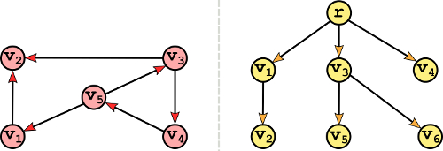](./readme/graph_vs_tree.jpg)

A graph `G=(V,E)` is usually defined in terms of two sets:

-	A set of vertices `V`: independent, distinct entities that can appear in any multiplicity. A graph can have 1, 2, 100 or any number of vertices but, in general, graphs don’t support duplicate vertices.
-	A set of edges `E` connecting vertices: an edge is a pair of vertices, the first one usually denoted as the source vertex, and the second one called the destination vertex.

Graphs are very similar to trees. They are both made of entities (vertices/nodes) connected by relations (edges), with a couple of differences:

-	In trees, vertices are usually called nodes;
-	In trees edges are somehow implicit: since they can only go from a node to its children, it’s more common to talk about parent/children relations than explicitly list edges. Also, because of this, trees are implicitly represented with adjacency lists.

Furthermore, trees have other peculiar characteristics that makes them a strict subset of the whole set of graphs; in particular, any tree is a _simple_, _undirected_, _connected_ and _acyclic_ graph.
